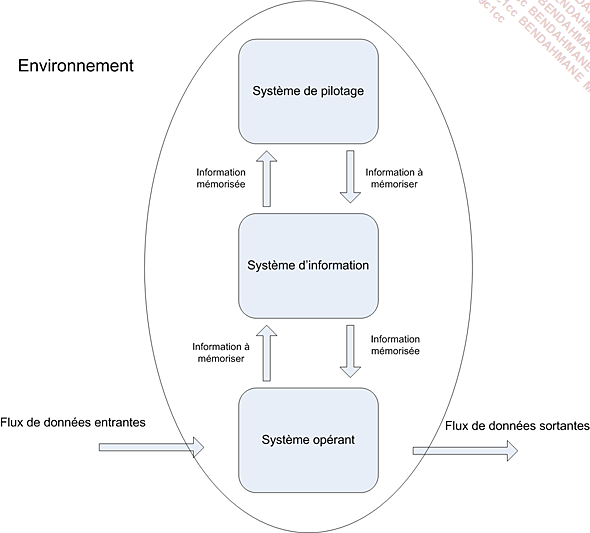
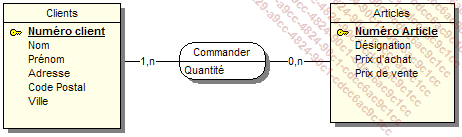

17/07/23 

# Modélisation de base de données

## 1. Introduction

``` sh
git init
```

Cette commande va initialiser un depot Git, Git va traquer toutes les modifications faites dans le dossier 

Pour consulter l'etat du depot Git il faut lancer la commande : 
``` sh
git status
``` 

Pour sauvegarder on utilise la commande :
``` sh
git commit
```

## 2. Merise

Merise est une méthode de modélisation de données. Elle permet de 
représenter les données d'un système d'information.
Merise est un acronyme de : Méthode d'Etude et de Résiliation Informatique pour les Systèmes d'Entreprise.

Présentation générale : 

Cette méthide se caractérise par 3 points clés : 

- Une approche dite systemique : on transforme les processus de 
l'entreprise en systeme d'information 

- Une séparation des données des traitements 

- Une approche nivellée


### L'Approche systemique 



Le système de pilotage : 
- Il est composé de l'ensemble des acteurs qui vont ** piloter ** le système d'information

Le système d'information : 
- Il est composé de l'ensemble des acteurs qui vont ** utiliser ** le système d'information

Le système operant : 
- Il est composé de l'ensemble des acteurs qui vont ** produire ** les données du système d'information

### La séparation des données et des traitements

La séparation des données et des traitements permet de séparer les données du système d'information et les 
traitements effectues sur ces données

Cette démarchce se fzit en 3 étapes : 

- L'analyse des flux : on analyse les flux d'informations entre les acteurs du systèmes d'information et les acteurs du système operant. 

- L'étude des documents interne (factures, bon de livraison,)

- L'étude des documents en extrenes (fournisseurs, clients,).


Les differents types d'informations :

- Les infos de bases ou elementaires : ce sont les données de base du système d'information
 
- Les informations calculées : ce sont les données calcules à partir des données de base

- Les traitements ou les fonctions : ce sont les traitements effectues sur les données de base pour obtenir les données calculées

En résumé : vous devrez identifier les données et les traitements éffectués sur ces données.

#### L'approche nivelée

Pour effectuer la conception d'un SI (système d'information), on va utiliser une approche nivelée,
Cette approche se compose de 4 niveaux : 

- Le niveau conceptuel
- Le niveau organisationnel
- Le niveau logique 
- Le niveau physique

#### Le niveau conceptuel 

Le niveau conceptuel permet de modéliser les données de l'entreprise.
On va utiliser le modèle conceptuel de données (MCD) pour modéliser les données
de l'entreprise, et le MCT pour modéliser les traitements effectués sur ces données.

#### Le niveau organisationnel 

Le niveau organisationnel permet d'integrer a l'analyse précédente toutes les notions de temporalité, de chronologie des opérations, de contraintes
géographiques. On va utiliser le modèle organisationnel des traitements (MDT) et le modèle organisationnel des données (MOD) pour modéliser les traitements de l'entreprise. 

En résumé on se pose les questions suivantes a partir des données receuillies au niveau conceptuel : 

*** Quand *** les traitements sont-ils éffectués ?
*** Ou *** les traitements sont-ils éffectués ? 
Par *** Qui *** les traitements sont-ils éffectués ? 


#### Le niveau logique 

Le niveau logique va permettre de modéliser les données de l'entreprise en utilisant le modèle logique de données (MLD) et les traitements 
de l'entreprise en utilisants le modèle logique des traitements (MLT)

Le MLD est indépendant des languages de programmation et des SGBD (système de gestion de base de données).

On repond a la question : *** Avec quoi *** les traitements sont-ils éffectués ?

#### Le niveau physique 

Il s'agit de l'organisation `réelle` des données. On va utiliser le modèle physique de données (MPD) 
et le modèle physique des traitements (MPT).

Ici, on apporte les solutions techniques de stockage des données et de traitements des données.

On repond a la question : *** Comment *** les traitements sont-ils éffectués ? 

#### Résumé : les 4 niveaux de Merise


### Des données aux dépendances fonctionnelles

Pour être integrées dans un système d'information, les données doivent être triées et organisées. 
On va souvent tenter de les classer par type de données : 

- chaînes de caratères, format texte 
- type alphanumérique, format texte
- le type numérique (integer, float ...)
- le type date (date, datetime, timestamp)
- le logique ou booléen (true, false)

Creation d'un dictionnaire de données 


### Les dépendances fonctionnelles 

Une dépendance fonctionnelle est une relation entre deux attributs d'une table.
Elle permet de définir une relation de dépendance entre deux attibuts d'une table.


Le rôle d'une dependance fonctionnelle est de permettre de definr une relation de dependance entre deux attibuts d'une table : une donnee A epend fonctionnellement d'une donnee B lorsque la valeur de B determine la valeur de A 


Le but de l'exercice est d'élaborer un MCD a partir d'un dictionnaire de données.

Ici on va introduire les notions d'entité, de relations et de propriétés. 

##### Les propriétés sont les informations de base d'un SI. 

##### Les entités sont les objets du SI.


Quelques définitions : 

- entité forte : une entité qui ne depend pas d'une autre entite pour exister 
- entité faible : une entité qui depend d'une autre entité pour exister

#### Les relations 


*** Les cardinalités *** : Elles permettent de définir le nombre d'occurences d'une entité par rapport à une autre entité.


Petits exemples : 


##### Les relations "porteuses"

Une relation est dite "porteuses" quand elle possède des propriétées.

 


####


Quelques règle de concpetion : 

- toute entité doit avoir un identifiant 

- toutes les propriétées dépendent fonctionnellement de l'identifiant

- le nom d'une propriété ne doit apparaître qu'une seule fois dans le MCD : si vous avez une entité Eleve et une entité Professeur, 
vous ne pouvez pas avoir une entité nom dans les deux entités. Il faut donc rennomer la propriété nom de l'entité Professeur en nomProfesseur par exemple. 

- les propriétés issues d'un calcul ne doivent pas apparaître dans le MCD.


Pour formaliser une dependance fonctionnelle on utilise la notion suivante : 

`Numéro adhérent (nom, prenom, code postal, ville, telephone, date d'adhésion, mail)`

La partie gauche (numéro adhérent) est la source de la dependance fonctionnelle.

La partie droite designe le `but` de la dépendance

#### Les dependances fonctionnelles composees


Si une dependance fonctionelle qui fait intervenir plus de deux attributs (source) on parle de dépendance fonctionnelle composee.

Exemple : Pour connaître le temps d'un coureur sur une étape donc il faut nous faut son numero ou son nom ainsi que le nom ou le numero de l'étape.

Formalisation : 

`(numéro courreur, numéro étape) (temps)`


#### Les dépendances fonctionnelles élémentaires

Une dépendance fonctionnelles A -> B est élémentaire s'il n'existe pas une donnée C, sous-ensemble de A, 
décrivant dépendance fonctionnelle type C -> B.

Exemples : 

- RefProduit -> LibelleProduit
- NumCommande RefProduit -> QuantiteCommande
- <strike>NumCommande RefProduit -> DesignationProduit</strike>

#### Dépendance fonctionelle élémentaire directe 

"On dit que la dépendance fonctionnelle A -> B est directe s'il n'esixte aucu attibut  tel que l'on puisse avoir A -> C et C -> B.
En d'autres termes, cela signifie que la dépendance fonctionnelle entre A et B ne peut pas être obtenue par transivité."


Exemple : 

- RefPromo -> NumApprenant
- NumApprenant -> NomApprenant
- RefPromo -> NomApprenant : RefPromo -> NumApprenant -> NomApprenant


#### Sujet TP/TD MCD jour 1


##### Les contraintes d'integrité fonctionnelle (CIF)

Definition : Une CIF est définie par le fait qu'une des entitées de l'association est completement determinée par la connaissance d'une ou de plusieurs entitées participant à l'association.

Exemple : 


Une Salle peut contenir 0 ou plusieurs ordianteurs. Un ordianteur existe dans une et une seule salle. 

Dans ce type de relation une CIF existe si on a une cardinalité 1,1


